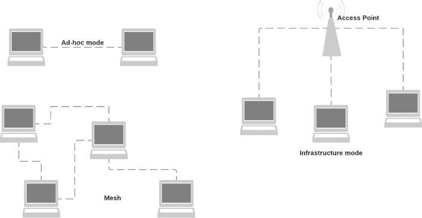
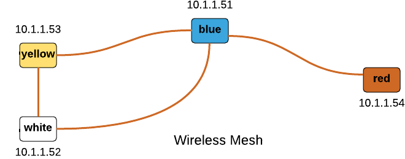
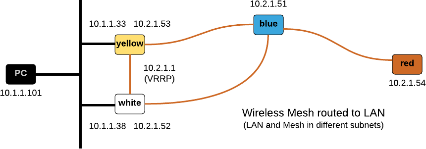
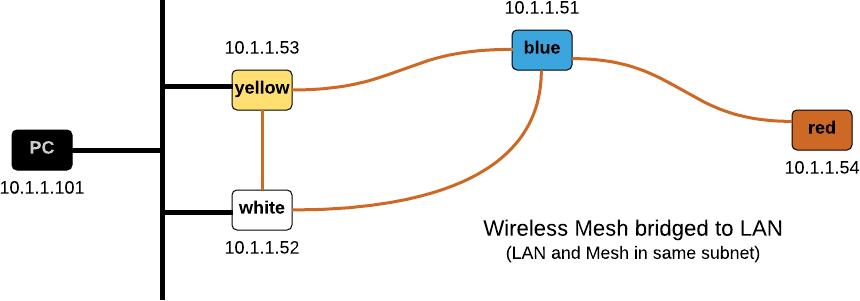

# 802.11s Wireless Mesh Network

*This document is work in progress*

## Overview

Originally the 802.11 WiFi standards defined two modes of operation, 
"ad-hoc" and "infrastructure".
The 802.11s amendment introduces another mode: mesh networks.
The distinguishing feature of mesh networks is that each node is able to forward
802.11 frames to other nodes, potentially extending the range of the overall
network. This is different from "infrastructure mode" where all nodes communicate
via a central Access Point.



Nodes in a wireless mesh network may be mobile and it is the task of a (OSI layer 2)
mesh routing protocols to continuously determine the optimal path between any two
mesh nodes. The 802.11s document mandates the 
[Hybrid Wireless Mesh Protocol (HWMP)](https://en.wikipedia.org/wiki/Hybrid_Wireless_Mesh_Protocol)
as the standard routing protocol but others can be implemented.

In this document I am going to describe how to configure a small wireless mesh network
based on the open80211s implementation on a few RaspberryPi.

## Hardware & Software

The following hardware and software was used for this experiment.

* Multiple RaspberryPi (various models) serving as Wireless Mesh Nodes and clients.
* [element14 WIPI WLAN USB Module](http://au.element14.com/element14/wipi/dongle-wifi-usb-for-raspberry/dp/2133900)
  for Raspberry Pi as it supports mesh mode.

## Configuring open80211s

In this section I am going to focus on how to get an 802.11s mesh network up and
running using the 
[open80211s](https://github.com/o11s)
software. open80211s is an open-source implementation
of the recently ratified IEEE 802.11s wireless mesh standard. The project's Wiki
page provides a lot of background information about 802.11s and the steps summarised
in this document are based on the Wiki page.

The 2016-05-27-raspbian-jessie-lite.img version of Raspbian serves as the base for
my experiments with the open80211s software. It is good practice to update the
distribution first.

```
$ sudo apt-get update
$ sudo apt-get dist-upgrade
$ reboot

$ uname -a
Linux yellow 4.4.13+ #894 Mon Jun 13 12:43:26 BST 2016 armv6l GNU/Linux
```

## Kernel support

The WiPi USB WLAN adapter uses a RT5370 chip which is supported through the 
[RT2800 driver](https://wiki.debian.org/rt2800usb). Most importantly is uses the
mac80211 module which is a pre-requisite for open80211s to work.

```
$ lsusb
Bus 001 Device 005: ID 148f:5370 Ralink Technology, Corp. RT5370 Wireless Adapter
...

$ sudo modprobe rt2800usb

$ lsmod | grep 2800
rt2800usb              18877  0
rt2800lib              82155  1 rt2800usb
rt2x00usb              12680  1 rt2800usb
rt2x00lib              48998  3 rt2x00usb,rt2800lib,rt2800usb
mac80211              608549  3 rt2x00lib,rt2x00usb,rt2800lib
crc_ccitt               1732  1 rt2800lib
```

In my setup, the WiPi adapter appears as the wlan1 interface.

```
$ iwconfig
...
wlan1     IEEE 802.11bgn  ESSID:off/any
          Mode:Managed  Access Point: Not-Associated   Tx-Power=20 dBm
          Retry short limit:7   RTS thr:off   Fragment thr:off
          Power Management:off
```

## Creating a wireless mesh network

As long as there is kernel support for the WLAN adapter, and the adapter supports
'mesh' mode, creating a wireless mesh is fairly straightforward. It involves the
following steps.

1. Defining a mesh interface name (mesh0 in the example below) and setting a `mesh_idi`.
   The mesh identifier has a similar purpose to the SSID in a "normal" WLAN.
2. Setting the channel. The WiPi adapter only supports the 2.4 GHz band and after doing
   a site survey I decided to use channel 4.
3. Shutting down the wlanX interface and bringing up the mesh0 interface instead.
4. Assigning an IP address.

```
$ sudo iw dev wlan1 interface add mesh0 type mp mesh_id MYMESHID
$ sudo iw dev mesh0 set channel 4
$ sudo ifconfig wlan1 down
$ sudo ifconfig mesh0 up
$ sudo ip addr add 10.1.100.10/24 dev mesh0
```

In my lab, I created a wireless mesh network as shown below. Let's see whether all
nodes are visible.



```
pi@yellow$ cat /etc/hosts
127.0.0.1    localhost yellow
10.2.1.51    blue-mesh
10.2.1.52    white-mesh
10.2.1.53    yellow-mesh
10.2.1.54    red-mesh

pi@yellow$ fping white-mesh red-mesh yellow-mesh blue-mesh
white-mesh is alive
red-mesh is alive
yellow-mesh is alive
blue-mesh is alive
```

There are a few commands that display status information about the mesh. The `station
dump` command displays all neighbouring mesh nodes.

```
pi@yellow$ sudo iw dev mesh0 station dump | grep Station
Station 40:a5:ef:0f:41:ef (on mesh0)
Station 40:a5:ef:0f:4b:e3 (on mesh0)
```

The output of the `mpath dump` command shows the current HWMP routing table.
Note how node 40:a5:ef:0f:46:df is reached via 40:a5:ef:0f:41:ef as it did not show
as a neighbour node in station dump.

```
pi@yellow$ sudo iw dev mesh0 mpath dump
DEST ADDR         NEXT HOP          IFACE    SN      METRIC  QLEN    EXPTIME         DTIM    DRET    FLAGS
40:a5:ef:0f:4b:e3 40:a5:ef:0f:4b:e3 mesh0    2       8769    0       0       0       0       0x14
40:a5:ef:0f:41:ef 40:a5:ef:0f:41:ef mesh0    5       8577    0       0       100     0       0x14
40:a5:ef:0f:46:df 40:a5:ef:0f:41:ef mesh0    11      18786   0       0       200     1       0x4
```

Because bitrate most links have a fairly weak signal, the bitrate is slow. This is reflected in the approximately 500 Kbits/sec bandwidth reported by iperf.

```
pi@yellow$ sudo iw dev mesh0 station dump | grep bitrate
     tx bitrate:     1.0 MBit/s
     rx bitrate:     1.0 MBit/s
     tx bitrate:     1.0 MBit/s
     rx bitrate:     1.0 MBit/s
```

## Security

*Note Unfortunately this currently does not work with the rt2800 driver (https://github.com/cozybit/authsae/issues/34).*

Currently the released version of wpa_supplicant does not support mesh mode. 802.11s
requires the "Simultaneous Authentication of Equals (SAE)" protocol with is implemented
in the (https://github.com/cozybit/authsae) project. Unfortunately this package must
be installed manually and has a few dependencies.

```
$ sudo apt-get install cmake libssl-dev libconfig-dev libnl-3-dev libnl-genl-3-dev
$ git clone https://github.com/cozybit/authsae
$ cd authsae
$ make
$ sudo make install
$ ls /usr/local/etc/authsae.cfg /usr/local/bin/meshd* /usr/local/bin/mon
/usr/local/bin/meshd
/usr/local/bin/meshd-nl80211
/usr/local/bin/mon
/usr/local/etc/authsae.cfg
```

The README explains the different settings in /usr/local/etc/authsae.cfg. Once
configured, start meshd-nl80211 as follows:

```
$ sudo meshd-nl80211 -c /usr/local/etc/authsae.cfg -o /var/log/meshd.log -B
```

## Routing between wireless mesh and LAN

A wireless mesh node that connects to a non-mesh network is called a Mesh Point
Portal (MPP). Most documents describe how a Mesh Point Portal is used to bridge
the mesh and the non-mesh networks. I am going to describe this in the next section.
First I explain how one can make the Mesh Point Portal a router connecting both
networks.

* Nodes yellow and white are both MPP with a VRRP address of 10.2.1.1 "floating"
  between them on the mesh network.
* Nodes yellow and white run a dynamic routing protocol on the non-mesh network
  (RIPv2 in the example below) to learn routes from other routers.
* Nodes red and blue use 10.2.1.1 as the default gateway.



### Configure VRRP on nodes yellow and white

```
pi@yellow$ sudo apt-get install keepalived

pi@yellow$ sudo vi /etc/keepalived/keepalived.conf
vrrp_instance VI_1 {
    state MASTER
    interface mesh0
    virtual_router_id 100
    priority 150
    advert_int 1
    authentication {
        auth_type PASS
        auth_pass mypasswd
    }
    virtual_ipaddress {
        10.2.1.1
    }
}
```

I decided to start keepalived from the command line. After a few seconds the mesh0 interface will have been assigned the 10.2.1.1 address.

```
pi@yellow$ sudo systemctl stop keepalived

pi@yellow$ sudo keepalived -f /etc/keepalived/keepalived.conf --vrrp

pi@yellow$ ip add li mesh0
5: mesh0: <BROADCAST,MULTICAST,UP,LOWER_UP> mtu 1500 qdisc mq state UP group default qlen 1000
    link/ether 40:a5:ef:0f:54:5a brd ff:ff:ff:ff:ff:ff
    inet 10.2.1.53/24 scope global mesh0
       valid_lft forever preferred_lft forever
    inet 10.2.1.1/32 scope global mesh0
       valid_lft forever preferred_lft forever
```

The same steps must be performed on node white, with the only difference that the
priority setting in the configuration file must be different.

### Configure dynamic routing on nodes yellow and white

For the purpose of simplicity I'll be configuring RIPv2 as this is the only protocol my
(consumer grade) Internet Router supports.

* Enable IPv4 forwarding.
* Create a minimal /etc/quagga/zebra.conf. Nothing will work without this file!
* Configure RIPv2 in /etc/quagga/ripd.conf.

```
pi@yellow$ sudo sysctl net.ipv4.ip_forward=1    # enable forwarding
pi@yellow$ sudo apt-get install quagga
pi@yellow$ sudo vi /etc/quagga/daemons
zebra=yes
...
ripd=yes

pi@yellow$ sudo vi /etc/quagga/zebra.conf
hostname yellow

pi@yellow$ sudo vi /etc/quagga/ripd.conf
router rip
  network eth0
  redistribute connected

pi@yellow$ sudo systemctl start quagga
```

### Configure the default gateway on red and blue

This step is straightforward, e.g.

```
pi@blue$ sudo route add -net default gw 10.2.1.1
pi@blue$ route -n
Destination     Gateway         Genmask         Flags Metric Ref    Use Iface
0.0.0.0         10.2.1.1        0.0.0.0         UG    0      0        0 mesh0
10.2.1.0        0.0.0.0         255.255.255.0   U     0      0        0 mesh0
```

Now I can ran a full traceroute to the Internet.

```
pi@blue$ sudo traceroute -I 150.101.213.146
traceroute to 150.101.213.146 (150.101.213.146), 30 hops max, 60 byte packets
 1  yellow-mesh      3.668 ms   3.480 ms   3.465 ms
 2  10.1.1.1         3.430 ms   3.367 ms   3.453 ms
 3  150.101.32.128  14.801 ms  16.476 ms  17.640 ms
 4  150.101.35.165  18.812 ms  24.582 ms  24.557 ms
 5  150.101.40.134  24.444 ms  20.036 ms  19.048 ms
 6  150.101.213.146 16.619 ms  14.815 ms  14.666 ms
```

Initially the packets will be routed via yellow as it currently holds the VRRP
address for the default gateway. If node yellow becomes unavailable, the VRRP
address will move to node white.

The main disadvantage of a routed solution is that the mesh nodes will send all
non-local traffic to the Portal that is currently the default gateway.
It is not possible to load-balance between multiple portals. In large mesh
topologies this may be a major disadvantage.

## Bridging the wireless mesh and the LAN

The alternative to routing between a mesh and a non-mesh network is bridging
them.

* Create a bridge with the non-mesh and mesh interface.
  Disable Spanning Tree on this bridge.
* Configure the Mesh Gateways to send HWMP gate announcements.



```
$ TODO
```

## Links

### 802.11s

The following links were useful sources of information.

* [802.11s Mesh Networking](https://www.cwnp.com/uploads/802-11s_mesh_networking_v1-0.pdf)
* [IEEE 802.11s Tutorial](http://www.ieee802.org/802_tutorials/06-November/802.11s_Tutorial_r5.pdf)
* [OpenWRT 802.11s based wireless mesh network](https://wiki.openwrt.org/doc/howto/mesh.80211s)

### Other Wireless Mesh Protocols

Apart from 802.11s there are a couple of alternative protocols implementing wireless
mesh networks.

* [Mobile Mesh Networks with the Raspberry Pi](http://www.ericerfanian.com/mobile-mesh-networks-with-the-raspberry-pi-part-1/)
* [Enabling mesh (ad-hoc) network on multiple Raspberry Pi’s](http://scalabilly.com/2015/08/mesh-ad-hoc-network-on-multiple-raspberry-pis/)
* [Heterogeneous Wireless Mesh Network Technology Evaluation for Space Proximity and Surface Applications](http://ntrs.nasa.gov/archive/nasa/casi.ntrs.nasa.gov/20140011882.pdf)

